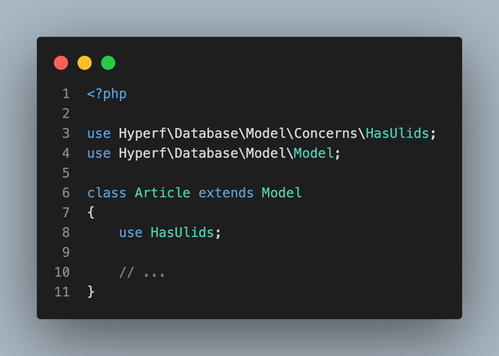

# model-uid-addon



[](https://packagist.org/packages/friendsofhyperf/model-uid-addon)
[](https://packagist.org/packages/friendsofhyperf/model-uid-addon)
[](https://github.com/friendsofhyperf/model-uid-addon)

The uid addon for hyperf Model.

## Installation

- Request

```bash
composer require friendsofhyperf/model-uid-addon
# ulid
composer require symfony/uid
# uuid
composer require ramsey/uuid:^4.7
```

## Usage

```php
<?php

namespace App\Model;

use Hyperf\Database\Model\Concerns\HasUlids;

class Article extends Model
{
    use HasUlids;

    // ...
}
```
