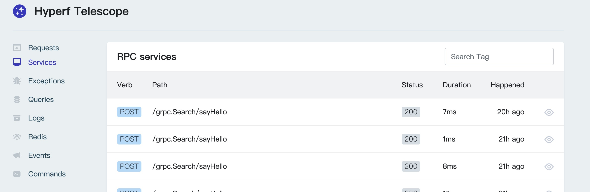

# Telescope

[](https://packagist.org/packages/friendsofhyperf/telescope)
[](https://packagist.org/packages/friendsofhyperf/telescope)
[](https://github.com/friendsofhyperf/telescope)

An elegant debug assistant for the hyperf framework.

## Functions

- [x] request
- [x] exception
- [x] sql
- [x] grpc server/client
- [x] redis
- [x] log
- [x] command
- [x] event
- [x] guzzle
- [x] cache
- [x] rpc server/client

## Installation

```shell
composer require friendsofhyperf/telescope:~3.1.0
```

## Publish

```shell
php bin/hyperf.php vendor:publish friendsofhyperf/telescope
```

## Migrate

```shell
php bin/hyperf.php migrate
```

## Add Listener

```php
<?php

// config/autoload/listeners.php

return [
    FriendsOfHyperf\Telescope\Listener\RequestHandledListener::class,
];

```

## Add Middleware

```php
<?php

// config/autoload/middlewares.php

return [
    'grpc' => [
        FriendsOfHyperf\Telescope\Middleware\TelescopeMiddleware::class,
    ],
];

```

> TelescopeMiddleware or RequestHandledListener, you can choose one of them.

## Add env

```env
# telescope
TELESCOPE_DB_CONNECTION=default

TELESCOPE_ENABLE_REQUEST=true
TELESCOPE_ENABLE_COMMAND=true
TELESCOPE_ENABLE_GRPC=true
TELESCOPE_ENABLE_LOG=true
TELESCOPE_ENABLE_REDIS=true
TELESCOPE_ENABLE_EVENT=true
TELESCOPE_ENABLE_EXCEPTION=true
TELESCOPE_ENABLE_JOB=true
TELESCOPE_ENABLE_DB=true
TELESCOPE_ENABLE_GUZZLE=true
TELESCOPE_ENABLE_CACHE=true
TELESCOPE_ENABLE_RPC=true

TELESCOPE_SERVER_ENABLE=true
```

## Visit

`http://127.0.0.1:9501/telescope`





## Tagging

you may want to attach your own custom tags to entries. To accomplish this, you may use the **`Telescope::tag`** method.

## Filtering

You may only want to record entries under certain special conditions. To achieve this, you may use the **`Telescope::filter`** method.

Example

```php
use FriendsOfHyperf\Telescope\Telescope;
use Hyperf\Event\Contract\ListenerInterface;
use Hyperf\Framework\Event\BootApplication;
use FriendsOfHyperf\Telescope\IncomingEntry;

class TelescopeInitListener implements ListenerInterface
{
    public function listen(): array
    {
        return [
            BootApplication::class,
        ];
    }

    public function process(object $event): void
    {
        // attach your own custom tags
        Telescope::tag(function (IncomingEntry $entry) {
            if ($entry->type === 'request') {
                return [
                    'status:' . $entry->content['response_status'],
                    'uri:'. $entry->content['uri'],
                ];
            }
        });

        // filter entry
        Telescope::filter(function (IncomingEntry $entry): bool {
            if ($entry->type === 'request'){
                if ($entry->content['uri'] == 'xxxx') {
                    return false;
                }
            }
            return true;
        });

    }
}
```

> You can also do this in middleware.
